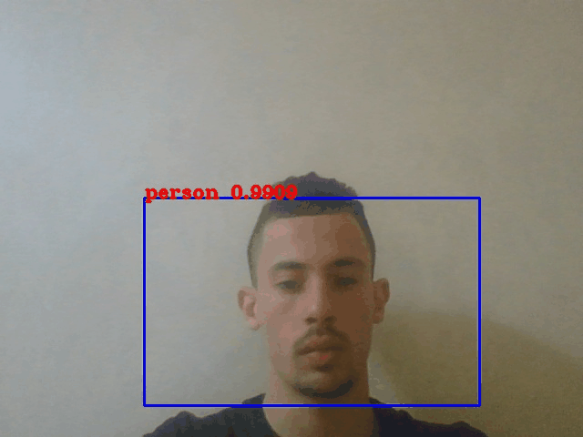
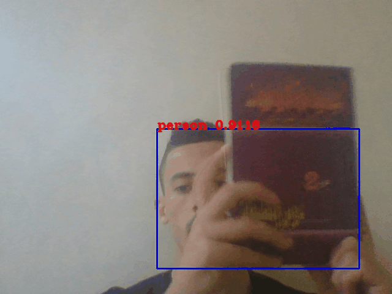
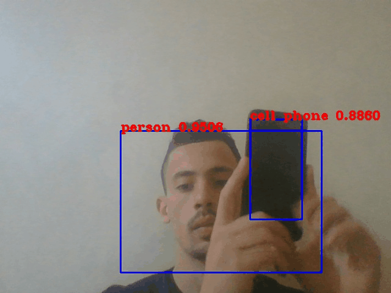
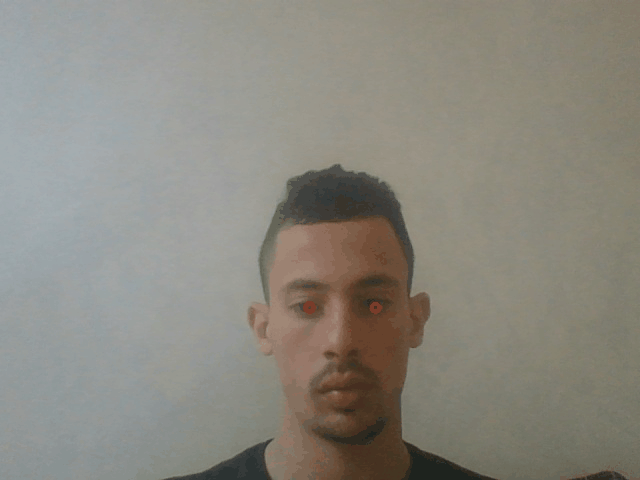

# AI-for-online-exams
As we know during online exams there is no surveillance , so that's project is a good help for teachers<br>
to tracks and know anything happened during exams using advanced Artificial intelligence technologies.

# Requirements

```tensorflow	2.3.1          ``` <br>
```opencv-python	4.4.0.46	 ```<br>
```speechrecognition	3.8.1	 ```<br>
```pandas	1.0.5	             ```<br>
```pyautogui	0.9.52	       ```<br>
```email                     ```<br>
```pydrive                   ```<br>

# important technologies : 
- face landmarks <br>
- eye tracking
- person , book , cell phone detection<br>
- voice recognition<br>
- screen recording <br>
- webcam recording <br>

# Person detecttion

# Book detecttion

# Cell phone detection

# Eyes recognition

# How that can help teachers ?
Its will inform him about all what heppend during exams by sending him an email that contain :<br>
-the webcam recorded video<br>
-screen recorded video (that will be upload via google drive) <br>
-discription file that contain all the actions that happend during exam with the exact time. <br>

<b>Exaple of action</b> : <br>
- probably sudent try to cheat via book at 300 sec from the beginig of exam. <br>
- probably student try to cheat via cell phone at 30 sec from the beginig of exam. <br>
- no person detectcted at 250 sec from the beginig of exam <br>
- more than one person deteceted. <br>
- sound detected 'hello' at .... <br>

# Steps to run the demo
1 - Install the dependencies
```bash
pip install -r requirements.txt
```
2 - At lines 647-649 put your email information access and email receivers.

3 - Download yolov3.weights file from here [weights](https://pjreddie.com/media/files/yolov3.weights)
and add to models folder.

# Which one main_v1 or main_v2 ? 
main_v1 is faster tha main_v2 because it does'nt contain screen recoreder

<b> Note </b>
if you want to use main_v2 follow this article to configure DRIVE api and download client_secret.json<br>
and put inside project directory.

# How teacher will use it?
- follow all the precednt steps
- Add to users.csv file Students names , family names and specific password for each one.
- generate .exe file for the project
- share the .exe and password with students
- student should execute .exe 2 min (just example ) before the start of exam and close after submitting their answers via email maybe.

# License 

```
This project is licensed under the MIT License - see the LICENSE.md file for details. However, the facial 
landmarks detection model is trained on non-commercial use datasets so I am not sure if that is allowed 
to be used for commercial purposes or not.
```
